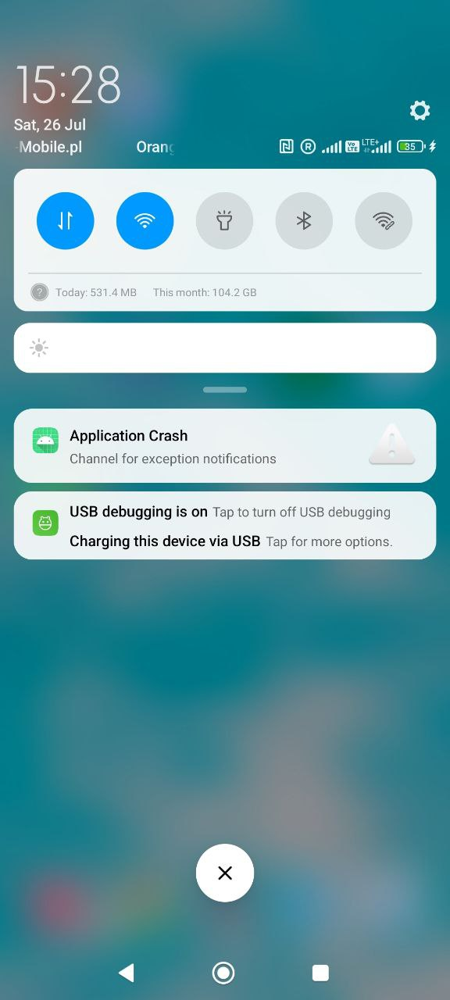

# Notification Crash Reports

This document provides instructions for integrating notification-based crash reporting in your Android application. Follow the steps below to add the necessary permissions and configure the crash reporting feature.

## Adding Permissions

To enable notifications for crash reporting, you must add the `POST_NOTIFICATIONS` permission to your `AndroidManifest.xml` file. This permission is required for Android 13 (API level 33) and above to display notifications.

Add the following line inside the `<manifest>` tag in your `AndroidManifest.xml`:

```xml
<uses-permission android:name="android.permission.POST_NOTIFICATIONS"/>
```

### Gradle settings
```kotlin
repositories {
    mavenCentral()
    maven { url = uri("https://jitpack.io") }
}

dependencies {
  implementation("com.github.antonykiev:Notification-Crash-Report:1.1")
}

```

### Notes

- For apps targeting Android 13 or higher, users must explicitly grant the notification permission at runtime. Ensure you handle this permission request appropriately in your app.
- For lower API levels, this permission is granted by default and does not require runtime handling.

## Configuring Crash Reporting

1. To set up crash reporting with notifications, configure the `notificationCrashReport` in your Application class. Below is an example implementation:

```kotlin
class SampleApp : Application() {
    override fun onCreate() {
        super.onCreate()
        notificationCrashReport {
            isDebug = true
            notification {
                title = "Sample Notification"
                message = "This is a sample notification message."
            }
        }
    }
}
```

### Explanation

- `isDebug`: Set to `true` to enable debug mode for crash reporting. This is useful during development to log additional details. Set to `false` in production to reduce verbosity.
- `notification`: Configures the notification displayed when a crash occurs.
    - `title`: The title of the notification (e.g., "Sample Notification").
    - `message`: The message content of the notification (e.g., "This is a sample notification message.").

### How to use

Let's say you have crash in your application. Then you will have a notification in your notification bar.



On click on this notification you will see an option where to send bug report


### Prerequisites

- Ensure your app includes a library or service that supports the `notificationCrashReport` function. This may be part of a third-party crash reporting SDK (e.g., Firebase Crashlytics, Sentry, etc.) or a custom implementation.
- Verify that your app targets the appropriate Android SDK version and handles runtime permissions for notifications if targeting Android 13 or higher.

## Testing

1. Add the permission to your `AndroidManifest.xml`.
2. Implement the crash reporting code in your Application class as shown above.
3. Trigger a test crash (e.g., by throwing an uncaught exception) to verify that the notification appears with the specified title and message.
4. Check the logs in debug mode to ensure crash details are captured correctly.

## Troubleshooting

- **Notification not appearing**: Ensure the `POST_NOTIFICATIONS` permission is granted. For Android 13+, prompt the user to allow notifications.
- **Crash report not sent**: Verify that the crash reporting library is properly initialized and that `isDebug` is set appropriately for your environment.
- **Library-specific issues**: Refer to the documentation of the crash reporting library you are using for additional configuration steps or requirements.